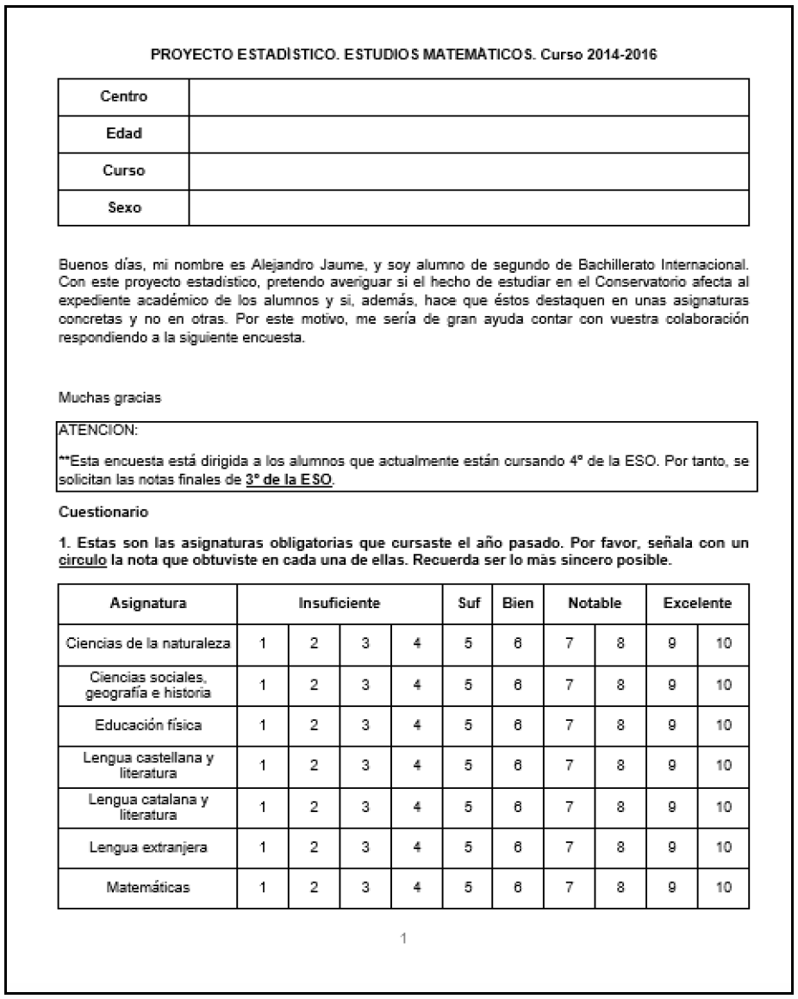
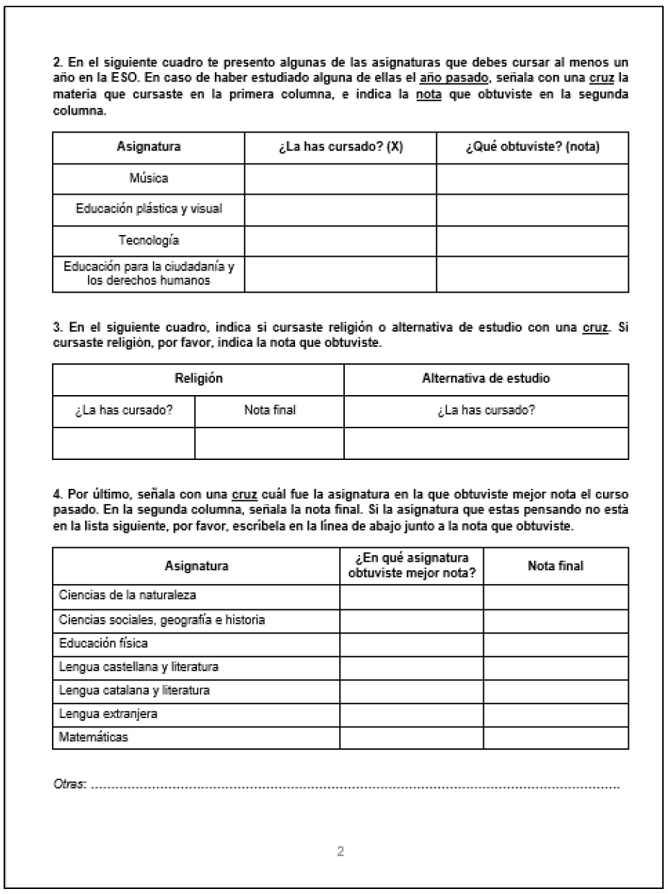

# Introduction

Music is an art form and means of expression that has been a part of human culture for thousands of years and has served many purposes, including entertainment, storytelling, religious or ceremonial rituals, and emotional expression. It is also said that music is a universal language that transcends cultural and linguistic boundaries, and has the power to evoke strong emotions and connect people from all ages and backgrounds.

With this in mind, many studies have explored the cognitive and academic benefits that music can bring. In fact, studies have found that studying music can improve language skills, particular in areas such as phonological awareness, vocabulary, and syntax. One study, for instance, found that musical ability is correlated with increased phonological abilities in second language learning (Slevc & Miyake, 2006) and with the learning of lexical tones that are used to differentiated word meaning in tone languages (Delogu et al., 2006; Wong & Perrachione, 2007). Other studies have shown that studying music can improve spatial-temporal skills, which are important for math and science reasoning (Hetland, 2000). Likewise, it has also been proven that learning and practicing music can enhance both working memory and executive function. Finally, studying music can also enhance creativity, as it involves improvisation and experimentation with different sounds and structures.

However, while its benefits on cognitive development and academic achievement have been widely debated, the relationship between music and school grades still remains unclear. Accordingly, this paper aims to further explore the impact that studying music may or may not have on school grades by comparing the academic performance of a group of 90 students who have had several years of musical training to a group of 90 students who have not had any musical training. We hypothesize that studying music will have a positive impact on school grades, meaning that students with musical abilities will perform better at school.


# Method

This study pretends to answer the following research question: to what extent does studying music positively impact the students' academic performance at school? In order to do so, we are going to compare the academic performance of a total of 180 students (age 15) in their junior year of high school. The students, however, are going to be divided in two groups. The first group (N=90, 45 females), will be comprised by students who have had, at least, six years of musical training at the Professional Conservatory of Music and Dance of Palma de Mallorca (Balearic Islands, Spain). The second group (N=90, 45 females), on the other hand, will be comprised by students who have never had any professional musical training. We chose the third year of high school because (1) we wanted our participants to have already had some years of high school experience and (2) because in the Spanish educational system, the third year of high school is the one with the highest number of shared common subjects, which considerably facilitates data collection.

Data were collected through a survey specifically designed for this study that all participants had to answer in person. The survey, which you can find in the appendices, consisted of four questions: the first one asked participants to indicate the grade that they obtained in the mandatory subjects they took during their third year of high school (1-10); the second question asked participants to indicate what elective or electives they took during their third year of high school and the grade they got; the third question asked participants whether they had taken religious studies in highs school or not and, if so, what grade they got; finally, the fourth question asked participants to indicate the subject in which they had obtained the best grade.

The Conservatory of Music and Dance of Palma de Mallorca is a public institution, which means that anybody can study there as long as they pass a series of aptitude tests. Therefore, the students at the Conservatory of Music and Dance come from different high schools in Mallorca. Accordingly, and in order to avoid confounding results, the participants in this study who have not had any kind of musical training also come from different high schools around Mallorca. These high schools are: IES Madina Mayurqa, IES Son Rullan, IES Son Pacs, IES Josep Maria Llompart, and Colegio San Vicente de Paul. Participants were selected at random by the instructors at each institution. The principal investigator (PI) administered the survey in person at the Conservatory of Music and Dance, IES Son Pacs, IES Madina Mayurqa, and Colegio San Vicente de Paul. However, the survey was administered by the instructor at IES Josep Maria Llompart and IES Son Rullan. At the moment of data collection, all participants in the study were in their fourth year of high school.

# Results

```{r, 'Loaded packages', message=FALSE, echo=FALSE, eval=TRUE}
library(papaja)
library(tinylabels)
library(ds4ling)
library(tidyverse)
library(untidydata)
library(here)
library(car)
library(broom)
library(emmeans)
library(lme4)
library(dplyr)
library(kableExtra)
library(gt)
options(scipen = 99)
```

* **Dataset**

  Once the participants had completed the survey, the data collected were introduce and organized in an excel document. Next, we converted the excel document into a .csv file and put into our R studio project. We used the function "read_csv" to read the .csv file and to visualize the data. After that, we tidied our data by selecting the colums that we wanted to use for this study: participants, sex, conservatorio (yes/no), natural science (c_nat), social science (c_soc), physical education (ef_fi), Spanish (leng_cas), Catalan (lang_cat), English (leng_est), mathematics (mat), art (plast), and technology (tecn). Finally, we used the function "write_csv" to save the new tidied dataset into the corresponding folder in our R studio project.
  

```{r echo=FALSE, warning=FALSE, 'Dataset', message=FALSE, eval=TRUE}

my_data <- read_csv(here("data", "data_raw_proyecto.csv"))

my_data_tidy <- select(my_data, participant, sex, conservatorio, c_nat, c_soc, ef_fi, leng_cas, leng_cat, leng_est, mat, plast, tecn)

my_data_tidy_proyecto <- my_data_tidy %>%
  write_csv(., path = "data/data_tidy_proyecto.csv")

```


  The following table summarizes the first six rows of our database. In order to do so, we used the functions "head()" and "gt()" in R and included our dataset.

```{r, 'Dataset: Table', message=FALSE, echo=FALSE, eval=TRUE}

my_data_tidy_proyecto %>%
  head(cex = 0.1) %>%
  gt() %>%
  tab_header(
    title = md("**Dataset**")
  ) %>%
  tab_options(
    table.font.size = 13
  ) %>% opt_table_font(
    font = list(
      google_font(name = "Merriweather")
    )
  )
  


```


* **Descriptive statistics**

  The following table shows the interquantile range (IQR) and the mean of the different variables included in our dataset. Specifically, we are interested in the nondemographic variables, which correspond to the different subjects taken by the participants in their third year of high school: natural sciences, social sciences, physical education, Spanish, Catalan, English, maths, art, and technology. For instance, we can see that, in the the case of natural sciences, the average grade (mean) was 7.106, the median was 7, the lowest grade (min) was 2, and the highest grade (max) was 10. However, these data represent the results of both the participants with musical training and the participants with no musical training combined. Therefore, we need to separate them in order to have a better idea of how they performed separately by subject.
  
```{r, echo=FALSE, eval=TRUE}
knitr::kable(summary(my_data_tidy_proyecto))

```


```{r, echo=FALSE, eval=TRUE}
knitr::kable(summary(my_data_tidy_proyecto))

```

  This table provides us with the mean and the standard deviation by subject and distinguishes between those participants with musical training and those participants with no musical training (conservatorio, no vs. si). Interestingly, we can see that, in all subjects, participants with musical training have a higher average grade compared to participants without musical training. In some cases, the means are withing fractions of each other, such as in the case of Spanish, where the average grade for the students with musical training was 7.76 and for the students without musical training was 7.34. In some other cases, however, the difference between means is larger. For instance, in the case of math, the average grade for the students with musical training was 7.77 and for the students without musical training was 5.89. 


```{r, 'Descriptive statistics', message=FALSE, echo=FALSE, eval=TRUE}

my_data_tidy_proyecto %>%
  group_by(., conservatorio) %>%
  summarize(., Nat = round(mean(c_nat), digits = 2), SDn = round(sd(c_nat), digits = 2),
               Soc = round(mean(c_soc), digits = 2), SDs = round(sd(c_soc), digits = 2),
               PE = round(mean(ef_fi), digits = 2), SDe = round(sd(ef_fi), digits = 2),
               Span = round(mean(leng_cas), digits = 2), SDsp = round(sd(leng_cas), digits = 2),
               Cat = round(mean(leng_cat), digits = 2), SDca = round(sd(leng_cat), digits = 2),
               Eng = round(mean(leng_est), digits = 2), SDen = round(sd(leng_est), digits = 2),
               Mat = round(mean(mat), digits = 2), SDm = round(sd(mat), digits = 2),
               Art = round(mean(plast), digits = 2), SDp = round(sd(plast), digits = 2),
               Tecn = round(mean(tecn), digits = 2), SDt = round(sd(tecn), digits = 2)) %>%
  gt() %>% 
  tab_header(
    title = md("**Average grade by subject**")
  ) %>%
  tab_options(
    table.font.size = 20) %>%
  tab_style(
    style = list(
      cell_text(weight = "bold")
    ),
    locations = cells_body(
      columns = Nat,
      rows = Nat >= 7.80)) %>%
  tab_style(
    style = list(
      cell_text(weight = "bold")
    ), locations = cells_body(
      columns = Soc,
      rows = Soc >= 7.50)) %>%
  tab_style(
    style = list(
      cell_text(weight = "bold")
    ), locations = cells_body(
      columns = PE,
      rows = PE >= 8.10)) %>%
  tab_style(
    style = list(
      cell_text(weight = "bold")
    ), locations = cells_body(
      columns = Span,
      rows = Span >= 7.40)) %>%
  tab_style(
    style = list(
      cell_text(weight = "bold")
    ), locations = cells_body(
      columns = Cat,
      rows = Cat >= 7.30)) %>%
  tab_style(
    style = list(
      cell_text(weight = "bold")
    ), locations = cells_body(
      columns = Eng,
      rows = Eng >= 7.70)) %>%
  tab_style(
    style = list(
      cell_text(weight = "bold")
    ), locations = cells_body(
      columns = Mat,
      rows = Mat >= 7.70)) %>%
  tab_style(
    style = list(
      cell_text(weight = "bold")
    ), locations = cells_body(
      columns = Art,
      rows = Art >= 8.20)) %>%
  tab_style(
    style = list(
      cell_text(weight = "bold")
    ), locations = cells_body(
      columns = Tecn,
      rows = Tecn >= 8)) %>%
  opt_table_font(
    font = list(
      google_font(name = "Merriweather")
    )
  )

```

  This table presents the same structure as the previous table but, in this case, it includes the differences between sex in both groups of participants. In the case of the students with musical training, we can see that males obtained better grades in natural sciences, physical education, maths, and art. On the contrary, females obtained better grades in social sciences, Spanish, and English. Both groups obtained the save average grade in Catalan and technology. In the case of the students with no musical training, the males performed better in all subjects. In fact, the subjects where the difference is higher are maths (0.71), art (0.65), and technology (0.65).


```{r echo=FALSE, message=FALSE, warning=FALSE, eval=TRUE}

my_data_tidy_proyecto %>%
  group_by(., conservatorio, sex) %>%
  summarize(., Nat = round(mean(c_nat), digits = 2), SDn = round(sd(c_nat), digits = 2),
               Soc = round(mean(c_soc), digits = 2), SDs = round(sd(c_soc), digits = 2),
               PE = round(mean(ef_fi), digits = 2), SDe = round(sd(ef_fi), digits = 2),
               Span = round(mean(leng_cas), digits = 2), SDsp = round(sd(leng_cas), digits = 2),
               Cat = round(mean(leng_cat), digits = 2), SDca = round(sd(leng_cat), digits = 2),
               Eng = round(mean(leng_est), digits = 2), SDen = round(sd(leng_est), digits = 2),
               Mat = round(mean(mat), digits = 2), SDm = round(sd(mat), digits = 2),
               Art = round(mean(plast), digits = 2), SDp = round(sd(plast), digits = 2),
               Tecn = round(mean(tecn), digits = 2), SDt = round(sd(tecn), digits = 2)) %>%
  gt() %>% 
  tab_header(
    title = md("**Average grade by subject**")
  ) %>%
  tab_options(
    table.font.size = 20) %>%
  tab_style(
    style = list(
      cell_text(weight = "bold")
    ),
    locations = cells_body(
      columns = Nat,
      rows = Nat >= 7.80)) %>%
  tab_style(
    style = list(
      cell_text(weight = "bold")
    ), locations = cells_body(
      columns = Soc,
      rows = Soc >= 7.50)) %>%
  tab_style(
    style = list(
      cell_text(weight = "bold")
    ), locations = cells_body(
      columns = PE,
      rows = PE >= 8.10)) %>%
  tab_style(
    style = list(
      cell_text(weight = "bold")
    ), locations = cells_body(
      columns = Span,
      rows = Span >= 7.40)) %>%
  tab_style(
    style = list(
      cell_text(weight = "bold")
    ), locations = cells_body(
      columns = Cat,
      rows = Cat >= 7.30)) %>%
  tab_style(
    style = list(
      cell_text(weight = "bold")
    ), locations = cells_body(
      columns = Eng,
      rows = Eng >= 7.70)) %>%
  tab_style(
    style = list(
      cell_text(weight = "bold")
    ), locations = cells_body(
      columns = Mat,
      rows = Mat >= 7.70)) %>%
  tab_style(
    style = list(
      cell_text(weight = "bold")
    ), locations = cells_body(
      columns = Art,
      rows = Art >= 8.20)) %>%
  tab_style(
    style = list(
      cell_text(weight = "bold")
    ), locations = cells_body(
      columns = Tecn,
      rows = Tecn >= 8)) %>%
  opt_table_font(
    font = list(
      google_font(name = "Merriweather")
    )
  )


```

* **Plots**

  The following plots represent the information presented in the previous table. As we can see, in the case of natural sciences, the male students with musical training obtained the higher grades, as opposed to the female students with no musical training, who obtained the lowest grade.
  
  
```{r, echo=FALSE, eval=TRUE}
my_data_tidy_proyecto %>%
  ggplot(aes(x = conservatorio, y = c_nat, color = sex)) + 
  geom_boxplot()     

```

  As we can see in the following chart, both male and female students with musical training and male students with no musical training obtained the same first quartile (6), median (8), third quartile (9), and max value (10). Only the lowest value is different, with males with no musical training having the lowest grade (2). On the other hand, the female students with no musical training obtained the lowest grades overall. 


```{r, echo=FALSE, eval=TRUE}
my_data_tidy_proyecto %>%
  ggplot(aes(x = conservatorio, y = c_soc, color = sex)) + 
  geom_boxplot()

```


  As we can see in the this plot, all groups obtained the same first quartile (7), median (8), third quantile (9), and max value (10). The only difference between them is the lowest value. For the male and female students with musical training, the lowest grade was a 6. For the male students with no musical training, the lowest grade was a 5. And for the female students with no musical training, the lowest grade was a 4.

```{r, echo=FALSE, eval=TRUE}

my_data_tidy_proyecto %>%
  ggplot(aes(x = conservatorio, y = ef_fi, color = sex)) + 
  geom_boxplot()

```

  The following plot presents more variability compared to the previous one. As we can see, the female students with musical training are the ones who obtained the highest grades in Spanish, the lowest grade being a 4, the highest a 10, and the median an 8. On the other hand, both the male students with musical training and the male students with no musical training had a very similar IQR. The only difference between them is shown in the lowest grade. The lowest grade for the male students with musical training is a 5, whereas the lowest grade for the male students with no musical training was a 4. In the case of the female students witout musical training, the lowest grade was a 3, the highest grade was a 9, and the median was a 6. This last group obtained the lowest grades overall.


```{r, echo=FALSE, eval=TRUE}

my_data_tidy_proyecto %>%
  ggplot(aes(x = conservatorio, y = leng_cas, color = sex)) + 
  geom_boxplot()

```

  In the case of Catalan, we found an interesting situation. the group of female students with musical training presents the same median and third quartile (8). This means that 50% of the grades are below 8 and the other 50% of the grades are above 8. The male students with musical training present a very similar IQR, except for the median, which is 7. For the male students without musical training, the lowest grade is a 4, the highest is a 10, and the median is a 6. For the female students without musical training, the lowest grade is a 3, the highest is a 9, and the median is a 6, which makes this group the one with the lowest grades overall.

```{r, echo=FALSE, eval=TRUE}

my_data_tidy_proyecto %>%
  ggplot(aes(x = conservatorio, y = leng_cat, color = sex)) + 
  geom_boxplot()

```

  The plot corresponding to English shows that, overall, the male students with musical training obtained the highest grades overall. The lowest grade was a 5, the highest a 10, and the median an 8. Interestingly, the female students with musical training and the male students without musical training present the same IQR, with the lowest grade being a 4, the highest a 10, and the median an 8. Finally, the females without musical training obtained the lowest grades overall. In this case, the lowest grade was a 3, the highest a 10, and the median a 7.


```{r, echo=FALSE, eval=TRUE}

my_data_tidy_proyecto %>%
  ggplot(aes(x = conservatorio, y = leng_est, color = sex)) + 
  geom_boxplot()

```

  The plot corresponding to maths clearly shows that the students with musical training (both males and females) outperformed the students with no musical training. Within this group, the male students are the ones who obtained the highest grades, the lowest being around 4 and the highest being 10. With regards to the female students with musical training, the lowest grade was also around 4, the highest was also 10. The difference between these two groups is that, in the male students, the third quartile and the max value are the same, whereas in the female students, these two values are different. In the case of the group of students with no musical training, the male group obtained higher grades overall. For instance, the lowest grade was around 3, the highest grade was 10, and the median was around 6. In the female group, on the other hand, the lowest grade was around 1.3, the highest was around 8.6, and the median was 5.


```{r, echo=FALSE, eval=TRUE}

my_data_tidy_proyecto %>%
  ggplot(aes(x = conservatorio, y = mat, color = sex)) + 
  geom_boxplot()

```

  The plot corresponding to art shows that, overall, the the students with musical training outperformed the students with no musical training. In fact, both male and female students with musical training presnt the same IQR, with the lowest grade being 7, the highest being 10, and the median being 8. Likewise, we can also notice three outliers in this group, one in the male studetns and two in the female students. In the case of the students with no musical training, we can see that the male students obtained better grades compares to the female students. For instance, their lowest grade was a 4, the highest was a 10, and the median was an 8. In the case of the female students with no musical training, the lowest grade was a 4, the highest was a 9, and the median was a 7. 


```{r, echo=FALSE, eval=TRUE}

my_data_tidy_proyecto %>%
  ggplot(aes(x = conservatorio, y = plast, color = sex)) + 
  geom_boxplot()

```

  The plot corresponding to technology shows that all four groups obtained very similar grades, which is reflected in their IQR. In all groups, the highest grade was a 10 and the median was an 8. The lowest grade, however, is different by group. Both male and female students with musical training obtained the same lowest grade (6). In the case of the students without musical training, the males' lowest grade was a 5, and the females' lowest grade was a 4.

```{r, 'Plots', message=FALSE, echo=FALSE, eval=TRUE}

my_data_tidy_proyecto %>%
  ggplot(aes(x = conservatorio, y = tecn, color = sex)) + 
  geom_boxplot()

```

* **Models**

  In order to determine if there is a relationship between the dependent variable (scores by subject) and the different independent variables (musical training and sex), we performed several linear regression models, one per subject. Likewise, in order to test for the statistical significance of the interaction effects, we used hierarchically nested model comparisons. Finally, we checked for model diagnosis. Linear regression makes several assumptions about the data at hand. Therefore, after performing a regression analysis, we should always check if the model works well for the data at hand. In addition, one of the key assumptions in linear regression is that there is no correlation between the residuals, e.g. the residuals are independent. Therefore, we performed a Durbin-Watson Test in order to check for autocorrelation of the residuals.


  + *Model: Natural Science*

```{r, 'Model: Natural Science', message=FALSE, echo=FALSE, eval=TRUE}

mod_null_c_nat <- lm(c_nat ~ 1, data = my_data_tidy_proyecto)

mod1_c_nat <- lm(c_nat ~ 1 + conservatorio, data = my_data_tidy_proyecto)

mod2_c_nat <- lm(c_nat ~ 1 + conservatorio + sex, data = my_data_tidy_proyecto)

mod_int_c_nat <- lm(c_nat ~ 1 + conservatorio + sex + conservatorio:sex, data = my_data_tidy_proyecto)

summary(mod_int_c_nat)

```

  The summary output of the linear regression model that examines the relationship between the natural sciences' scores (c_nat, a continuous dependent variable) and musical training (conservatorio) and sex, both categorical independent variables, in addition to their interaction term shows that the intercept (6.0889) is the expected mean value of the dependent variable when all the independent variables are set to zero. In addition, the coefficient for "conservatorio" (1.6889) indicates that when when students have had musical training, the expected mean value of the natural sciences' scores increases by 1.6889, holding all other independent variables constant. In fact, since the p-value is lower than 0.05 (p < 0.001), we can confirm that there is a significant interaction between natural sciences scores and musical training, meaning that having musical training improves your overall natural sciences' scores. Furthermore, the coefficient for sex (0.6000) suggests that being male is associated with an increase of 0.6000 in the expected mean value of the natural sciences' scores compared to being female, holding all other independent variables constant. However, since the p-value (0.0665) is greater than 0.05, the significance of this coefficient is questionable. The coefficient for the interaction term between musical training (conservatorio) and sex (-0.5111) suggests that the effect of musical training on natural sciences' scores depends on the individual's sex. However, since the p-value (0.2676) is greater than 0.05, the significance of this interaction term is questionable as well. The p-value of the overall model is also smaller than 0.05 (p < 0.001), indicating that the model as a whole is significant.

```{r, echo=FALSE, eval=TRUE}
anova(mod_null_c_nat, mod1_c_nat, mod2_c_nat, mod_int_c_nat)
```

  As previously stated, in order to test for the statistical significance of the interaction effects, we used hierarchically nested model comparisons. These results represent the Analysis of Variance (ANOVA) table for the linear regression model that examines the relationship between natural sciences' scores and musical training and sex, in addition to their interaction term. The ANOVA table compares four different models, each of which includes different predictors: Model 1 includes only the intercept term; Model 2 includes the intercept term and the musical training (conservatorio) variable; Model 3 includes the intercept term, the conservatorio variable, and the sex variable; and Model 4 includes the intercept term, the conservatorio variable, the sex variable, and the interaction term. As we can see, Model 2 has a p-value that is smaller than 0.05 (p < 0.001), indicating that the effect of musical training on natural sciences' scores is statistically significant. Model 3 has a p-value of 0.1357, which is greater than 0.05. Therefore, the effect of sex on natural sciences' scores is not statistically significant. Finally, model 4 has a p-value of 0.2676, which is also greater than 0.05. Therefore, the interaction effect between musical training and sex on natural sciences' scores is not statistically significant.


```{r, 'Check Model Diagnosis: Natural Science', message=FALSE, echo=FALSE, eval=TRUE}

plot(mod_int_c_nat)

```


  After performing a regression analysis, we checked if the model works well for the data at hand. In fact, linear regression makes several assumptions about the data, such as linearity of the data (the relationship between predictor (x) and outcome (y) is assumed to be linear), normality of residuals (the residual errors are assumed to be normally distributed), homogeneity of residuals variance (the residuals are assumed to have constant variance or homoscedasticity), and independence of residual errors terms. To do so, we used the function "plot()", which creates a series of ggplot2-based graphics. The diagnostic plots show residuals in four different ways: residuals vs. fitted; normal Q-Q; scale-Location; and residuals vs Leverage.

  The residuals vs. fitted plot is used to check the linear relationship assumptions. A horizontal line, without distinct patterns, is an indication for a linear relationship. Therefore, the red line should be almost horizontal at zero. In this case, we see no patterns in the residual plot. We see a red horizontal line at zero, which suggests that we can assume linear relationship between the predictors and the outcome variables. The scale-location plot is used to check the homogeneity of variance of the residuals (homoscedasticity). A horizontal line with equally spread points is a good indication of homoscedasticity. In our case, we can see a horizontal line with equally spread points, which indicates homoscedasticity. The normal Q-Q plot is used to examine whether the residuals are normally distributed, and an indication of this is if the residual points follow the straight dashed line. In our case, all the points fall approximately along the reference line. Therefore, we can assume normality. The residuals vs. leverage plot is used to identify influential cases, that is extreme values that might influence the regression results when included or excluded from the analysis. In our case, the plot highlights the top 3 mosyt extreme points (#40, #51, and #94).


```{r, 'Durbin-Watson Test: Natural Science', message=FALSE, echo=FALSE, eval=TRUE}
durbinWatsonTest(mod_int_c_nat)
```

  Finally, in order to check for autocorrelation of the residuals, we performed a Durbin-Watson Test using the function "durbinWatsonTest()". Our H_0 (null hypothesis) is that there is no correlation among the residuals, and our H_A (alternative hypothesis) is that the residuals are autocorrelated. From the output, we can see that the test statistic is 1.878689 and the corresponding p-value is 0.386. Since the p-value is higher than 0.05, we can accept the null hypothesis and conclude that the residuals in this regression model are not autocorrelated.

  + *Model: Social Sciences*

```{r,'Model: Social Sciences', message=FALSE, echo=FALSE, eval=TRUE}

mod_null_c_soc <- lm(c_soc ~ 1, data = my_data_tidy_proyecto)

mod1_c_soc <- lm(c_soc ~ 1 + conservatorio, data = my_data_tidy_proyecto)

mod2_c_soc <- lm(c_soc ~ 1 + conservatorio + sex, data = my_data_tidy_proyecto)

mod_int_c_soc <- lm(c_soc ~ 1 + conservatorio + sex + conservatorio:sex, data = my_data_tidy_proyecto)

summary(mod_int_c_soc)

```

  The summary output of the linear regression model that examines the relationship between the social sciences' scores (c_soc) and musical training (conservatorio) and sex, in addition to their interaction term, shows that the intercept (7) is the expected mean value of the dependent variable when all the independent variables are set to zero. In addition, the coefficient for "conservatorio" (0.6444) indicates that, on average, students who attend the Conservatory of Music and Dance have a social sciences' score that is 0.6444 higher than students who do not attend the Conservatory of Music and Dance, holding all other variables constant. However, this effect is not statistically significant at the 0.05 level (p = 0.0664). The coefficient for sex is also 0.6444, indicating that, on average, males have a social sciences' score that is 0.6444 higher than females, holding all other variables constant. However, this effect is not statistically significant at the 0.05 level (p = 0.0664). The coefficient for the interaction term between musical training (conservatorio) and sex (-0.8222) suggests that the effect of attending the Conservatory of Music and Dance on social sciences' scores differs depending on sex. Specifically, the effect of attending a conservatory is estimated to be 0.8222 lower for males than for females, holding all other variables constant. However, this effect is also not statistically significant at the 0.05 level (p = 0.0973).

```{r, echo=FALSE, eval=TRUE}
anova(mod_null_c_soc, mod1_c_soc, mod2_c_soc, mod_int_c_soc)

```

  In order to test for the statistical significance of the interaction effects, we used hierarchically nested model comparisons. These results represent the Analysis of Variance (ANOVA) table for the linear regression model that examines the relationship between social sciences' scores and musical training and sex, in addition to their interaction term. The ANOVA table compares four different models, each of which includes different predictors: Model 1 includes only the intercept term; Model 2 includes the intercept term and the musical training (conservatorio) variable; Model 3 includes the intercept term, the conservatorio variable, and the sex variable; and Model 4 includes the intercept term, the conservatorio variable, the sex variable, and the interaction term. Looking at the p-values for the F-tests, we can see that adding the conservatorio variable in Model 2 did not significantly improve the fit of the model compared to Model 1. Similarly, adding the sex variable in Model 3 did not significantly improve the fit compared to Model 2. However, adding the interaction term conservatorio:sex in Model 4 did result in a significant improvement in fit compared to Model 3, with an F-value of 2.7782 and a p-value of 0.09734. However, the effect is not statistically significant.

```{r, 'Check Model Diagnosis: Social Science', message=FALSE, echo=FALSE, eval=TRUE}
plot(mod_int_c_soc)
```
 After performing a regression analysis, we checked if the model works well for the data at hand. The residuals vs. fitted plot shows red horizontal line at zero, with no patterns, which suggests that we can assume linear relationship between the predictors and the outcome variables. The scale-location shows a horizontal line with equally spread points, which indicates homoscedasticity. With respect the normal Q-Q plot, all the points fall approximately along the reference line. Therefore, we can assume normality. Finally, the residuals vs. leverage plot highlights the top 3 most extreme points (#5, #44, and #45).

```{r, 'Durbin-Watson Test: Social Science', message=FALSE, echo=FALSE, eval=TRUE}
durbinWatsonTest(mod_int_c_soc)
```

  Finally, in order to check for autocorrelation of the residuals, we performed a Durbin-Watson Test. Our H_0 (null hypothesis) is that there is no correlation among the residuals, and our H_A (alternative hypothesis) is that the residuals are autocorrelated. From the output, we can see that the test statistic is 1.864671 and the corresponding p-value is 0.294. Since the p-value is higher than 0.05, we can accept the null hypothesis and conclude that the residuals in this regression model are not autocorrelated.

  + *Model: Physical Education*

```{r, 'Model: Physical Education', message=FALSE, echo=FALSE, eval=TRUE}

mod_null_ef_fi <- lm(ef_fi ~ 1, data = my_data_tidy_proyecto)

mod1_ef_fi <- lm(ef_fi ~ 1 + conservatorio, data = my_data_tidy_proyecto)

mod2_ef_fi <- lm(ef_fi ~ 1 + conservatorio + sex, data = my_data_tidy_proyecto)

mod_int_ef_fi <- lm(ef_fi ~ 1 + conservatorio + sex + conservatorio:sex, data = my_data_tidy_proyecto)

summary(mod_int_ef_fi)

```

  The summary output of the linear regression model that examines the relationship between the physical education scores (ef_fi) and musical training (conservatorio) and sex, in addition to their interaction term, shows that the intercept (7.88889) is the expected mean value of the dependent variable when all the independent variables are set to zero. In addition, the coefficient for "conservatorio" (0.13333) indicates that, on average, students who attend the Conservatory of Music and Dance have a physical education score that is 0.13333 higher than students who do not attend the Conservatory of Music and Dance, holding all other variables constant. However, this effect is not statistically significant at the 0.05 level (p = 0.621). The coefficient for sex is 0-06667, indicating that, on average, males have a physical education score that is 0.06667 higher than females, holding all other variables constant. However, this effect is not statistically significant at the 0.05 level (p = 0.248). The coefficient for the interaction term between musical training (conservatorio) and sex (0.20000) suggests that the effect of attending the Conservatory of Music and Dance on physical education scores differs depending on sex. Specifically, the effect of attending a conservatory is estimated to be 0.20000 higher for males than for females, holding all other variables constant. However, this effect is also not statistically significant at the 0.05 level (p = 0.526).


```{r, echo=FALSE, eval=TRUE}
anova(mod_null_ef_fi, mod1_ef_fi, mod2_ef_fi, mod_int_ef_fi)

```

  In order to test for the statistical significance of the interaction effects, we used hierarchically nested model comparisons. These results represent the Analysis of Variance (ANOVA) table for the linear regression model that examines the relationship between physical education scores and musical training and sex, in addition to their interaction term. The ANOVA table compares four different models, each of which includes different predictors: Model 1 includes only the intercept term; Model 2 includes the intercept term and the musical training (conservatorio) variable; Model 3 includes the intercept term, the conservatorio variable, and the sex variable; and Model 4 includes the intercept term, the conservatorio variable, the sex variable, and the interaction term. Looking at the p-values for the F-tests, we can see that adding the conservatorio variable in Model 2 did not significantly improve the fit of the model compared to Model 1 (F=1.50, p=0.22). Similarly, adding the sex variable in Model 3 did not significantly improve the fit compared to Model 2 (F=0.77, p=0.38), and adding the interaction term conservatorio:sex in Model 4 did not significantly improve the fit compared to Model 3 either (F=0.28, p=0.60).
  
```{r, 'Check Model Diagnosis: Physical Education', message=FALSE, echo=FALSE, eval=TRUE}
plot(mod_int_ef_fi)
```

 After performing a regression analysis, we checked if the model works well for the data at hand. The residuals vs. fitted plot shows red horizontal line at zero, with no patterns, which suggests that we can assume linear relationship between the predictors and the outcome variables. The scale-location shows a horizontal line with equally spread points, which indicates homoscedasticity. With respect the normal Q-Q plot, all the points fall approximately along the reference line. Therefore, we can assume normality. Finally, the residuals vs. leverage plot highlights the top 3 most extreme points (#30, #31, and #67).

```{r, 'Durbin-Watson Test: Physical Education', message=FALSE, echo=FALSE, eval=TRUE}
durbinWatsonTest(mod_int_ef_fi)
```

  Finally, in order to check for autocorrelation of the residuals, we performed a Durbin-Watson Test. Our H_0 (null hypothesis) is that there is no correlation among the residuals, and our H_A (alternative hypothesis) is that the residuals are autocorrelated. From the output, we can see that the test statistic is 1.838989 and the corresponding p-value is 0.258. Since the p-value is higher than 0.05, we can accept the null hypothesis and conclude that the residuals in this regression model are not autocorrelated.
  
  + *Model: Spanish*

```{r, 'Model: Spanish', message=FALSE, echo=FALSE, eval=TRUE}

mod_null_leng_cas <- lm(leng_cas ~ 1, data = my_data_tidy_proyecto)

mod1_leng_cas <- lm(leng_cas ~ 1 + conservatorio, data = my_data_tidy_proyecto)

mod2_leng_cas <- lm(leng_cas ~ 1 + conservatorio + sex, data = my_data_tidy_proyecto)

mod_int_leng_cas <- lm(leng_cas ~ 1 + conservatorio + sex + conservatorio:sex, data = my_data_tidy_proyecto)

summary(mod_int_leng_cas)

```

  The summary output of the linear regression model that examines the relationship between the Spanish scores (leng_cas) and musical training (conservatorio) and sex, in addition to their interaction term, shows that the intercept (6.1111) is the expected mean value of the dependent variable when all the independent variables are set to zero. In addition, the coefficient for "conservatorio" (1.3111) indicates that when when students have had musical training, the expected mean value of the Spanish scores increases by 1.3111, holding all other independent variables constant. In fact, since the p-value is lower than 0.05 (p < 0.001), we can confirm that there is a significant interaction between Spanish scores and musical training, meaning that having musical training improves your Spanish scores. Furthermore, the coefficient for sex (0.6222) suggests that being male is associated with an increase of 0.6222 in the expected mean value of the Spanish scores compared to being female, holding all other independent variables constant. This difference is marginally statistically significant (p = 0.0486). The coefficient for the interaction term between musical training (conservatorio) and sex (-0.6667) suggests that the effect of musical training on Spanish scores depends on the individual's sex. However, this interaction effect is not statistically significant (p = 0.1343).

```{r, echo=FALSE, eval=TRUE}
anova(mod_null_leng_cas, mod1_leng_cas, mod2_leng_cas, mod_int_leng_cas)

```
  In order to test for the statistical significance of the interaction effects, we used hierarchically nested model comparisons. These results represent the Analysis of Variance (ANOVA) table for the linear regression model that examines the relationship between Spanish scores and musical training and sex, in addition to their interaction term. The ANOVA table compares four different models, each of which includes different predictors: Model 1 includes only the intercept term; Model 2 includes the intercept term and the musical training (conservatorio) variable; Model 3 includes the intercept term, the conservatorio variable, and the sex variable; and Model 4 includes the intercept term, the conservatorio variable, the sex variable, and the interaction term. As we can see, Model 2 has a p-value that is smaller than 0.05 (p < 0.001), indicating that the effect of musical training on Spanish scores is statistically significant. Model 3 has a p-value of 0.1940, which is greater than 0.05. Therefore, the effect of sex on Spanish scores is not statistically significant. Finally, model 4 has a p-value of 0.1343, which is also greater than 0.05. Therefore, the interaction effect between musical training and sex on Spanish scores is not statistically significant.

```{r, 'Check Model Diagnosis: Spanish', message=FALSE, echo=FALSE, eval=TRUE}
plot(mod_int_leng_cas)
```

 After performing a regression analysis, we checked if the model works well for the data at hand. The residuals vs. fitted plot shows red horizontal line at zero, with no patterns, which suggests that we can assume linear relationship between the predictors and the outcome variables. The scale-location shows a horizontal line with equally spread points, which indicates homoscedasticity. With respect the normal Q-Q plot, all the points fall approximately along the reference line. Therefore, we can assume normality. Finally, the residuals vs. leverage plot highlights the top 3 most extreme points (#13, #73 and #121).

```{r, 'Durbin-Watson Test: Spanish', message=FALSE, echo=FALSE, eval=TRUE}
durbinWatsonTest(mod_int_leng_cas)
```

  Finally, in order to check for autocorrelation of the residuals, we performed a Durbin-Watson Test. Our H_0 (null hypothesis) is that there is no correlation among the residuals, and our H_A (alternative hypothesis) is that the residuals are autocorrelated. From the output, we can see that the test statistic is 1.810181 and the corresponding p-value is 0.216. Since the p-value is higher than 0.05, we can accept the null hypothesis and conclude that the residuals in this regression model are not autocorrelated.

  + *Model: Catalan*

```{r, 'Model: Catalan', message=FALSE, echo=FALSE, eval=TRUE}

mod_null_leng_cat <- lm(leng_cat ~ 1, data = my_data_tidy_proyecto)

mod1_leng_cat <- lm(leng_cat ~ 1 + conservatorio, data = my_data_tidy_proyecto)

mod2_leng_cat <- lm(leng_cat ~ 1 + conservatorio + sex, data = my_data_tidy_proyecto)

mod_int_leng_cat <- lm(leng_cat ~ 1 + conservatorio + sex + conservatorio:sex, data = my_data_tidy_proyecto)

summary(mod_int_leng_cat)

```

  The summary output of the linear regression model that examines the relationship between the Catalan scores (leng_cat) and musical training (conservatorio) and sex, in addition to their interaction term, shows that the intercept (5.9778) is the expected mean value of the dependent variable when all the independent variables are set to zero. In addition, the coefficient for "conservatorio" (1.4000) indicates that when when students have had musical training, the expected mean value of the Catalan scores increases by 1.4000, holding all other independent variables constant. In fact, since the p-value is lower than 0.05 (p < 0.001), we can confirm that there is a significant interaction between Catalan scores and musical training, meaning that having musical training improves your Spanish scores. Furthermore, the coefficient for sex (0.4667) suggests that being male is associated with an increase of 0.4667 in the expected mean value of the Catalan scores compared to being female, holding all other independent variables constant. However, this difference is not statistically significant (p = 0.144). The coefficient for the interaction term between musical training (conservatorio) and sex (-0.4667) suggests that the effect of musical training on Catalan scores depends on the individual's sex. However, this interaction effect is not statistically significant (p = 0.301).

```{r, echo=FALSE, eval=TRUE}
anova(mod_null_leng_cat, mod1_leng_cat, mod2_leng_cat, mod_int_leng_cat)

```
  In order to test for the statistical significance of the interaction effects, we used hierarchically nested model comparisons. These results represent the Analysis of Variance (ANOVA) table for the linear regression model that examines the relationship between Catalan scores and musical training and sex, in addition to their interaction term. The ANOVA table compares four different models, each of which includes different predictors: Model 1 includes only the intercept term; Model 2 includes the intercept term and the musical training (conservatorio) variable; Model 3 includes the intercept term, the conservatorio variable, and the sex variable; and Model 4 includes the intercept term, the conservatorio variable, the sex variable, and the interaction term. As we can see, Model 2 has a p-value that is smaller than 0.05 (p < 0.001), indicating that the effect of musical training on Catalan scores is statistically significant. Model 3 has a p-value of 0.3013, which is greater than 0.05. Therefore, the effect of sex on Catalan scores is not statistically significant. Finally, model 4 has a p-value of 0.3013, which is also greater than 0.05. Therefore, the interaction effect between musical training and sex on Catalan scores is not statistically significant.
  
```{r, 'Check Model Diagnosis: Catalan', message=FALSE, echo=FALSE, eval=TRUE}
plot(mod_int_leng_cat)
```

 After performing a regression analysis, we checked if the model works well for the data at hand. The residuals vs. fitted plot shows red horizontal line at zero, with no patterns, which suggests that we can assume linear relationship between the predictors and the outcome variables. The scale-location shows a horizontal line with equally spread points, which indicates homoscedasticity. With respect the normal Q-Q plot, all the points fall approximately along the reference line. Therefore, we can assume normality. Finally, the residuals vs. leverage plot highlights the top 3 most extreme points (#13, #127 and #132).

```{r, 'Durbin-Watson Test: Catalan', message=FALSE, echo=FALSE, eval=TRUE}
durbinWatsonTest(mod_int_leng_cat)
```

  Finally, in order to check for autocorrelation of the residuals, we performed a Durbin-Watson Test. Our H_0 (null hypothesis) is that there is no correlation among the residuals, and our H_A (alternative hypothesis) is that the residuals are autocorrelated. From the output, we can see that the test statistic is 1.899911 and the corresponding p-value is 0.44. Since the p-value is higher than 0.05, we can accept the null hypothesis and conclude that the residuals in this regression model are not autocorrelated.

  + *Model: English*

```{r, 'Model: English', message=FALSE, echo=FALSE, eval=TRUE}


mod_null_leng_est <- lm(leng_est ~ 1, data = my_data_tidy_proyecto)

mod1_leng_est <- lm(leng_est ~ 1 + conservatorio, data = my_data_tidy_proyecto)

mod2_leng_est <- lm(leng_est ~ 1 + conservatorio + sex, data = my_data_tidy_proyecto)

mod_int_leng_est <- lm(leng_est ~ 1 + conservatorio + sex + conservatorio:sex, data = my_data_tidy_proyecto)

summary(mod_int_leng_est)

```

  The summary output of the linear regression model that examines the relationship between the English scores (leng_est) and musical training (conservatorio) and sex, in addition to their interaction term, shows that the intercept (7.0667) is the expected mean value of the dependent variable when all the independent variables are set to zero. In addition, the coefficient for "conservatorio" (0.7111) indicates that when when students have had musical training, the expected mean value of the Catalan scores increases by 0.7111, holding all other independent variables constant. In this case, the p-value is 0.0509, which may indicate a slightly significant interaction between English scores and musical training, meaning that having musical training could slightly improve your English scores. Furthermore, the coefficient for sex (0.5333) suggests that being male is associated with an increase of 0.5333 in the expected mean value of the English scores compared to being female, holding all other independent variables constant. However, this difference is not statistically significant (p = 0.1422). The coefficient for the interaction term between musical training (conservatorio) and sex (-0.5778) suggests that the effect of musical training on English scores depends on the individual's sex. However, this interaction effect is not statistically significant (p = 0.2603).

```{r, echo=FALSE, eval=TRUE}
anova(mod_null_leng_est, mod1_leng_est, mod2_leng_est, mod_int_leng_est)

```
  In order to test for the statistical significance of the interaction effects, we used hierarchically nested model comparisons. These results represent the Analysis of Variance (ANOVA) table for the linear regression model that examines the relationship between English scores and musical training and sex, in addition to their interaction term. The ANOVA table compares four different models, each of which includes different predictors: Model 1 includes only the intercept term; Model 2 includes the intercept term and the musical training (conservatorio) variable; Model 3 includes the intercept term, the conservatorio variable, and the sex variable; and Model 4 includes the intercept term, the conservatorio variable, the sex variable, and the interaction term. Looking at the p-values for the F-tests, we can see that adding the conservatorio variable in Model 2 did not significantly improve the fit of the model compared to Model 1 (F=2.7248, p=0.1006). Similarly, adding the sex variable in Model 3 did not significantly improve the fit compared to Model 2 (F=0.9133, p=0.3406), and adding the interaction term conservatorio:sex in Model 4 did not significantly improve the fit compared to Model 3 either (F=1.2756, p=0.2603).

```{r, 'Check Model Diagnosis: English', message=FALSE, echo=FALSE, eval=TRUE}
plot(mod_int_leng_est)
```
 After performing a regression analysis, we checked if the model works well for the data at hand. The residuals vs. fitted plot shows red horizontal line at zero, with no patterns, which suggests that we can assume linear relationship between the predictors and the outcome variables. The scale-location shows a horizontal line with equally spread points, which indicates homoscedasticity. With respect the normal Q-Q plot, all the points fall approximately along the reference line. Therefore, we can assume normality. Finally, the residuals vs. leverage plot highlights the top 3 most extreme points (#5, #29 and #121).

```{r, 'Durbin-Watson Test: English', message=FALSE, echo=FALSE, eval=TRUE}
durbinWatsonTest(mod_int_leng_est)
```
  
  Finally, in order to check for autocorrelation of the residuals, we performed a Durbin-Watson Test. Our H_0 (null hypothesis) is that there is no correlation among the residuals, and our H_A (alternative hypothesis) is that the residuals are autocorrelated. From the output, we can see that the test statistic is 1.916163 and the corresponding p-value is 0.55. Since the p-value is higher than 0.05, we can accept the null hypothesis and conclude that the residuals in this regression model are not autocorrelated.

  + *Model: Math*

```{r, 'Model: Math', message=FALSE, echo=FALSE, eval=TRUE}
mod_null_mat <- lm(mat ~ 1, data = my_data_tidy_proyecto)

mod1_mat <- lm(mat ~ 1 + conservatorio, data = my_data_tidy_proyecto)

mod2_mat <- lm(mat ~ 1 + conservatorio + sex, data = my_data_tidy_proyecto)

mod_int_mat <- lm(mat ~ 1 + conservatorio + sex + conservatorio:sex, data = my_data_tidy_proyecto)

summary(mod_int_mat)

```
  The summary output of the linear regression model that examines the relationship between the math scores (mat) and musical training (conservatorio) and sex, in addition to their interaction term, shows that the intercept (5.5333) is the expected mean value of the dependent variable when all the independent variables are set to zero. In addition, the coefficient for "conservatorio" (2.0889) indicates that when when students have had musical training, the expected mean value of the math scores increases by 2.0889, holding all other independent variables constant. This difference is statistically significant (p < 0.001). Furthermore, the coefficient for sex (0.7111) suggests that being male is associated with an increase of 0.7111 in the expected mean value of the math scores compared to being female, holding all other independent variables constant. However, this difference is marginally statistically significant (p = 0.0721). The coefficient for the interaction term between musical training (conservatorio) and sex (-0.4222) suggests that the effect of musical training on math scores depends on the individual's sex. However, this interaction effect is not statistically significant (p = 0.4485).

```{r, echo=FALSE, eval=TRUE}
anova(mod_null_mat, mod1_mat, mod2_mat, mod_int_mat)
```
  
  In order to test for the statistical significance of the interaction effects, we used hierarchically nested model comparisons. These results represent the Analysis of Variance (ANOVA) table for the linear regression model that examines the relationship between math scores and musical training and sex, in addition to their interaction term. The ANOVA table compares four different models, each of which includes different predictors: Model 1 includes only the intercept term; Model 2 includes the intercept term and the musical training (conservatorio) variable; Model 3 includes the intercept term, the conservatorio variable, and the sex variable; and Model 4 includes the intercept term, the conservatorio variable, the sex variable, and the interaction term. As we can see, Model 2 has a p-value that is smaller than 0.05 (p < 0.001), indicating that the effect of musical training on math scores is statistically significant. Model 3 has a p-value of 0.07372, which is slightly greater than 0.05. Therefore, the effect of sex on math scores is marginally statistically significant. Finally, model 4 has a p-value of 0.44850, which is also greater than 0.05. Therefore, the interaction effect between musical training and sex on math scores is not statistically significant.

```{r, 'Check Model Diagnosis: Math', message=FALSE, echo=FALSE, eval=TRUE}
plot(mod_int_mat)
```
  After performing a regression analysis, we checked if the model works well for the data at hand. The residuals vs. fitted plot shows red horizontal line at zero, with no patterns, which suggests that we can assume linear relationship between the predictors and the outcome variables. The scale-location shows a horizontal line with equally spread points, which indicates homoscedasticity. With respect the normal Q-Q plot, all the points fall approximately along the reference line. Therefore, we can assume normality. Finally, the residuals vs. leverage plot highlights the top 3 most extreme points (#16, #42 and #120).

```{r, 'Durbin-Watson Test: Math', message=FALSE, echo=FALSE, eval=TRUE}
durbinWatsonTest(mod_int_mat)
```

  Finally, in order to check for autocorrelation of the residuals, we performed a Durbin-Watson Test. Our H_0 (null hypothesis) is that there is no correlation among the residuals, and our H_A (alternative hypothesis) is that the residuals are autocorrelated. From the output, we can see that the test statistic is 1.734837 and the corresponding p-value is 0.086. Since the p-value is higher than 0.05, we can accept the null hypothesis and conclude that the residuals in this regression model are not autocorrelated.

  + *Model: Art*

```{r, 'Model: Arts', message=FALSE, echo=FALSE, eval=TRUE}
mod_null_plast <- lm(plast ~ 1, data = my_data_tidy_proyecto)

mod1_plast <- lm(plast ~ 1 + conservatorio, data = my_data_tidy_proyecto)

mod2_plast <- lm(plast ~ 1 + conservatorio + sex, data = my_data_tidy_proyecto)

mod_int_plast <- lm(plast ~ 1 + conservatorio + sex + conservatorio:sex, data = my_data_tidy_proyecto)

summary(mod_int_plast)

```

  The summary output of the linear regression model that examines the relationship between the art scores (plast) and musical training (conservatorio) and sex, in addition to their interaction term, shows that the intercept (6.9556) is the expected mean value of the dependent variable when all the independent variables are set to zero. In addition, the coefficient for "conservatorio" (1.2222) indicates that when when students have had musical training, the expected mean value of the art scores increases by 1.2222, holding all other independent variables constant. This difference is statistically significant (p < 0.001). Furthermore, the coefficient for sex (0.6444) suggests that being male is associated with an increase of 0.6444 in the expected mean value of the art scores compared to being female, holding all other independent variables constant. This difference is statistically significant (p = 0.0227). The coefficient for the interaction term between musical training (conservatorio) and sex (-0.6000) suggests that the effect of musical training on art scores depends on the individual's sex. However, this interaction effect is not statistically significant (p = 0.1319).

```{r, echo=FALSE, eval=TRUE}
anova(mod_null_plast, mod1_plast, mod2_plast, mod_int_plast)

```

  In order to test for the statistical significance of the interaction effects, we used hierarchically nested model comparisons. These results represent the Analysis of Variance (ANOVA) table for the linear regression model that examines the relationship between art scores and musical training and sex, in addition to their interaction term. The ANOVA table compares four different models, each of which includes different predictors: Model 1 includes only the intercept term; Model 2 includes the intercept term and the musical training (conservatorio) variable; Model 3 includes the intercept term, the conservatorio variable, and the sex variable; and Model 4 includes the intercept term, the conservatorio variable, the sex variable, and the interaction term. As we can see, Model 2 has a p-value that is smaller than 0.05 (p < 0.001), indicating that the effect of musical training on art scores is statistically significant. Model 3 has a p-value of 0.08396, which is slightly greater than 0.05. Therefore, the effect of sex on art scores is marginally statistically significant. Finally, model 4 has a p-value of 0.13188, which is also greater than 0.05. Therefore, the interaction effect between musical training and sex on art scores is not statistically significant.

```{r, 'Check Model Diagnosis: Arts', message=FALSE, echo=FALSE, eval=TRUE}
plot(mod_int_plast)
```
  After performing a regression analysis, we checked if the model works well for the data at hand. The residuals vs. fitted plot shows red horizontal line at zero, with no patterns, which suggests that we can assume linear relationship between the predictors and the outcome variables. The scale-location shows a horizontal line with equally spread points, which indicates homoscedasticity. With respect the normal Q-Q plot, all the points fall approximately along the reference line. Therefore, we can assume normality. Finally, the residuals vs. leverage plot highlights the top 3 most extreme points (#20, #86 and #133).

```{r, 'Durbin-Watson Test: Arts', message=FALSE, echo=FALSE, eval=TRUE}
durbinWatsonTest(mod_int_plast)
```

  Finally, in order to check for autocorrelation of the residuals, we performed a Durbin-Watson Test. Our H_0 (null hypothesis) is that there is no correlation among the residuals, and our H_A (alternative hypothesis) is that the residuals are autocorrelated. From the output, we can see that the test statistic is 2.171191 and the corresponding p-value is 0.302. Since the p-value is higher than 0.05, we can accept the null hypothesis and conclude that the residuals in this regression model are not autocorrelated.

**Model: Technology**

```{r, 'Model: Technology', message=FALSE, echo=FALSE, eval=TRUE}

mod_null_tecn <- lm(tecn ~ 1, data = my_data_tidy_proyecto)

mod1_tecn <- lm(tecn ~ 1 + conservatorio, data = my_data_tidy_proyecto)

mod2_tecn <- lm(tecn ~ 1 + conservatorio + sex, data = my_data_tidy_proyecto)

mod_int_tecn <- lm(tecn ~ 1 + conservatorio + sex + conservatorio:sex, data = my_data_tidy_proyecto)

summary(mod_int_tecn)

```

  The summary output of the linear regression model that examines the relationship between the technology scores (tecn) and musical training (conservatorio) and sex, in addition to their interaction term, shows that the intercept (6.5778) is the expected mean value of the dependent variable when all the independent variables are set to zero. In addition, the coefficient for "conservatorio" (1.4889) indicates that when when students have had musical training, the expected mean value of the technology scores increases by 1.4889, holding all other independent variables constant. This difference is statistically significant (p < 0.001). Furthermore, the coefficient for sex (0.6444) suggests that being male is associated with an increase of 0.6444 in the expected mean value of the technology scores compared to being female, holding all other independent variables constant. This difference is statistically significant (p = 0.0288). The coefficient for the interaction term between musical training (conservatorio) and sex (-0.6000) suggests that the effect of musical training on technology scores depends on the individual's sex. However, this interaction effect is not statistically significant (p = 0.1208).

```{r, echo=FALSE, eval=TRUE}
anova(mod_null_tecn, mod1_tecn, mod2_tecn, mod_int_tecn)

```

  In order to test for the statistical significance of the interaction effects, we used hierarchically nested model comparisons. These results represent the Analysis of Variance (ANOVA) table for the linear regression model that examines the relationship between technology scores and musical training and sex, in addition to their interaction term. The ANOVA table compares four different models, each of which includes different predictors: Model 1 includes only the intercept term; Model 2 includes the intercept term and the musical training (conservatorio) variable; Model 3 includes the intercept term, the conservatorio variable, and the sex variable; and Model 4 includes the intercept term, the conservatorio variable, the sex variable, and the interaction term. As we can see, Model 2 has a p-value that is smaller than 0.05 (p < 0.001), indicating that the effect of musical training on technology scores is statistically significant. Model 3 has a p-value of 0.1208, which is greater than 0.05. Therefore, the effect of sex on technology scores is not statistically significant. Finally, model 4 has a p-value of 0.2308, which is also greater than 0.05. Therefore, the interaction effect between musical training and sex on technology scores is not statistically significant.

```{r, 'Check Model Diagnosis: Technology', message=FALSE, echo=FALSE, eval=TRUE}
plot(mod_int_tecn)
```
  After performing a regression analysis, we checked if the model works well for the data at hand. The residuals vs. fitted plot shows red horizontal line at zero, with no patterns, which suggests that we can assume linear relationship between the predictors and the outcome variables. The scale-location shows a horizontal line with equally spread points, which indicates homoscedasticity. With respect the normal Q-Q plot, all the points fall approximately along the reference line. Therefore, we can assume normality. Finally, the residuals vs. leverage plot highlights the top 3 most extreme points (#5, #20 and #31).

```{r, 'Durbin-Watson Test: Technology', message=FALSE, echo=FALSE, eval=TRUE}
durbinWatsonTest(mod_int_tecn)
```
  
  Finally, in order to check for autocorrelation of the residuals, we performed a Durbin-Watson Test. Our H_0 (null hypothesis) is that there is no correlation among the residuals, and our H_A (alternative hypothesis) is that the residuals are autocorrelated. From the output, we can see that the test statistic is 1.57429 and the corresponding p-value is 0.008. Since the p-value is lower than 0.05, we can reject the null hypothesis and conclude that the residuals in this regression model are autocorrelated.

# Conclusions

  Overall, and based on the results, we can conclude that studying music positively impacts the students’ academic performance at school. However, this impact is, in some case, not statistically significant. In general, participants with musical training have a higher average grade in all subjects compared to participants without musical training. In some cases, the means are withing fractions of each other, such as in the case of Spanish. In some other cases, however, the difference between means is larger, such as in the case of math. The several linear regression models that we performed as well as the nested model comparisons confirm that attending the Conservatory of Music and Dance of Palma de Mallorca is related to a better performance at school in certain subjects, specifically: natural sciences, Spanish, Catalan, math,  art, and technology. It should also be noted that the differences between both males and females do not appear to be statistically significant in the majority of the cases. 

# References

```{r create_r-references-paper, eval=TRUE, echo=FALSE}

r_refs(file = "r-references-paper.bib")

```


# Apendices

```{r}
#\ label: img1

```

```{r}
#\ label: img2

```


